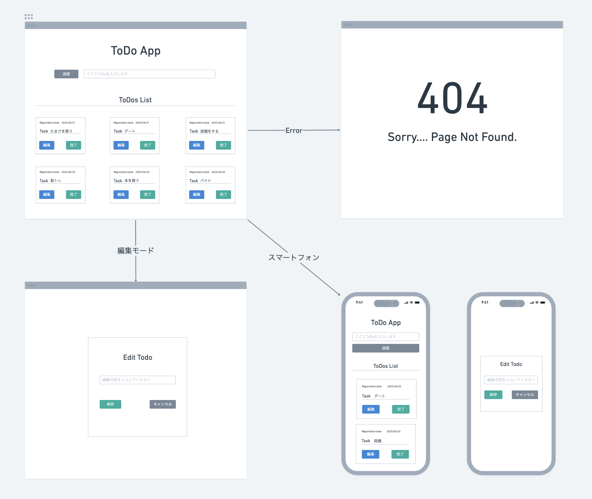
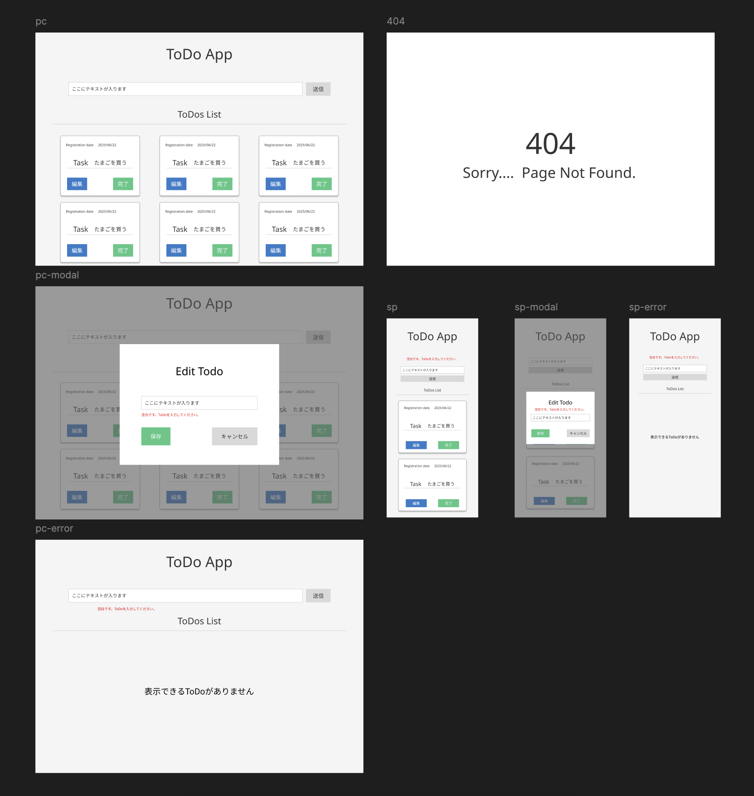

# ToDoApp

MERN スタックとユーザー認証機能を学ぶために開発したタスク管理アプリケーション

## 開発目的

こちらのプロジェクトは以下の技術スタックと概念を学ぶために開発しました。

### 学習した技術と概念

**認証とセキュリティ**

- セッションベース認証の仕組み
- bcrypt によるパスワードハッシュ化
- Cookie 管理（httpOnly、secure、sameSite）
- セッションハイジャック対策
- ユーザーごとのデータ分離

**フロントエンド**

- React Context API でのグローバル状態管理
- React Router での保護されたルート実装
- 非同期処理とローディング状態管理
- フォームバリデーションとエラーハンドリング

**バックエンド**

- RESTful API 設計
- Express ミドルウェアの理解
- MongoDB でのリレーション設計
- CORS 設定とプロキシ対応

**インフラ・デプロイ**

- 開発環境と本番環境の設定分離
- 環境変数の適切な管理
- クラウドプロキシ環境でのセッション管理
- CI/CD パイプラインの構築

**問題解決能力**

- デバッグとトラブルシューティング
- セキュリティ脆弱性の理解と対策
- 本番環境特有の問題への対処

# アプリの概要

このアプリは MERN スタック(MongoDB, Express, React, Node.js)を使用して構築した、ユーザー認証機能付きの ToDo 管理アプリです。
ユーザーごとに独立したタスク管理が可能。セキュアなセッション管理により安全にデータを保護します。

## 使用技術

### フロントエンド

- React (Vite)
- React Router
- Context API (認証状態管理)
- Tailwind CSS
- Axios

### バックエンド

- Node.js + Express
- MongoDB Atlas
- Mongoose
- bcrypt (パスワードハッシュ化)
- express-session (セッション管理)

### デプロイ・インフラ

- Render

## 主な機能

### 認証機能

- ユーザー登録・ログイン・ログアウト
- セッションベースの認証
- パスワードのハッシュ化（bcrypt）
- 保護されたルート（PrivateRoute）
- Cookie 設定（httpOnly、secure、sameSite）

### ToDo 管理機能

- タスクの新規追加
- タスクの一覧表示（ユーザーごとに表示）
- タスクの編集・削除
- タスク完了・未完了切り替え
- バリデーション（空欄禁止、文字制限）

## セキュリティ機能

- パスワードのハッシュ化（bcrypt）
- セッションベース認証
- HttpOnly Cookie（XSS 対策）
- HTTPS 通信（secure Cookie）
- CSRF 対策（sameSite 属性）
- ユーザーごとのデータ分離

## ワイヤーフレーム

## デザインカンプ

## API 仕様

### 認証エンドポイント

#### POST `/api/auth/register`

- 目的: 新規ユーザー登録
- リクエストボディ: `{ username, password }`
- レスポンス: `{ username }`

#### POST `/api/auth/login`

- 目的: ログイン
- リクエストボディ: `{ username, password }`
- レスポンス: `{ username }`

#### POST `/api/auth/logout`

- 目的: ログアウト
- レスポンス: `{ message }`

#### GET `/api/auth/me`

- 目的: 現在のユーザー情報取得
- レスポンス: `{ user: { username, id } }`

### ToDo エンドポイント（要認証）

#### GET `/api/todos`

- 目的: ログインユーザーの ToDo リストを取得
- 認証: 必須

#### POST `/api/todos`

- 目的: 新しい ToDo を追加
- リクエストボディ: `{ content }`
- 認証: 必須

#### PATCH `/api/todos/:id`

- 目的: 指定した ID の ToDo を更新
- リクエストボディ: `{ content }`
- 認証: 必須（自分の Todo のみ）

#### DELETE `/api/todos/:id`

- 目的: 指定した ID の ToDo を削除
- 認証: 必須（自分の Todo のみ）

## CI/CD

このアプリは以下のタスクを GitHub Actions によって自動化しています。

- テストの自動実行 `npm test`
- main ブランチにマージされた際に Render に自動デプロイ

詳細な設定は`.github/workflows/main.yml`に記述しています。

## ローカル環境でのセットアップ手順

### 1. リポジトリをクローン

$ git clone https://github.com/takeshi0518/ToDoApp.git  
$ cd ToDoApp

### 2. サーバー環境変数の設定

server/.env ファイルを作成し、以下を追加  
MONGO_URI=your_mongo_connection_string  
SESSION_SECRET=your_random_secret_key  
PORT=8080

### 3. クライアント環境変数の設定

client/.env ファイルを作成し、以下を追加  
VITE_API_URL=http://localhost:8080/api

### 4.サーバー起動

$ cd server  
$ npm install  
$ npm run dev

### 5. クライアント起動(別ターミナル)

$ cd client  
$ npm install  
$ npm run dev  
ブラウザで http://localhost:5173 にアクセス  

### 本番環境の環境変数

Render.com で以下の環境変数を設定してください  
MONGO_URI=your_mongo_connection_string  
SESSION_SECRET=your_random_secret_key  
注意: NODE_ENV は環境変数として設定せず、package.json の start スクリプトで設定されます。

## Git 運用メモ

### ブランチ命名

- `chore/` コードなどの整理
- `feat/` 新機能追加
- `fix/` バグの修正
- `docs/` ドキュメント関連の修正
- `refactor` リファクタリング
- `style` フォーマット・スペース・インデントの調整

### コミットメッセージ規則

- `feat: ユーザー登録機能を追加`
- `fix: ログイン処理でクラッシュするバグを修正`
- `docs: READMEにAPI仕様を追記`

## 今後の実装予定

- アカウント情報の編集機能
- アカウント削除機能
- パスワードリセット機能
- JWT 認証への移行を検討中
